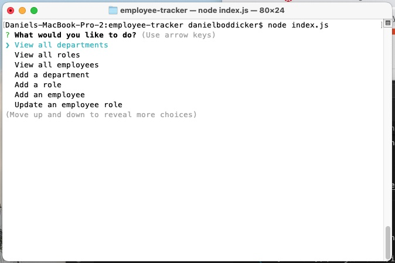
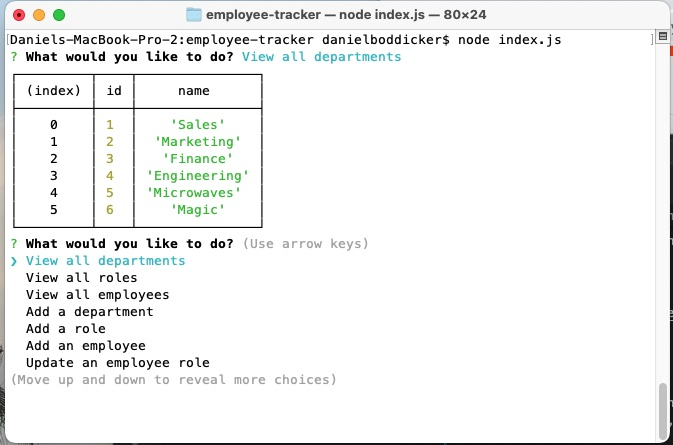
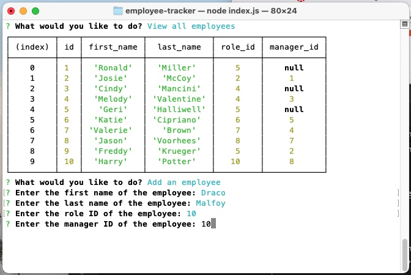
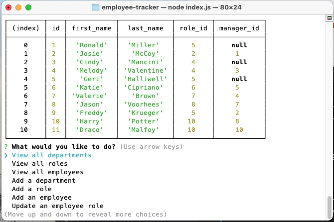

# Homework 12 - Employee Tracker

## Description

For this assignment, I was asked to created a terminal application to be used as an Employee Tracking Database. I was not given starter code for this project. 

## Table of Contents

- [Installation](#installation)
- [Usage](#usage)
- [Contributing](#contributing)
- [Tests](#tests)
- [Questions](#questions)

## License

    This project has no license.

## Installation

Node.js (https://nodejs.org/en/download), the Inquirer Package (https://www.npmjs.com/package/inquirer), the Console.Table Package (https://www.npmjs.com/package/console.table/v/0.10.0) and the MySql Package (https://www.npmjs.com/package/mysql) are necessary to run this application in the terminal. 

## Usage

Once the application is up and running, the user will be presented with a list of options: View all departments, View all roles, View all employees, Add a department, Add a role, Add an employee, or Update an employee role.

If one of the three first options is selected, it will present a user with the table representing that data. For example, here is the table when 'View all departments' is selected. Please note the main menu repeats to allow the user to continue using the database.

This application also allows to update the database. For example when the user is asked to add an employee, they will be presented with a series of data inputs: first name, last name, role ID, and manager ID. For example when adding Draco Malfoy:

Will place him in the employee database.

Updating departments and roles takes similar steps.

## Contributing

Thank you to instructors Bryan and Shawn for their un-ending patience. I used W3 Schools as a reference guide. Chat GBT was used to generate seed data, though I changed the names.

## Questions

My GitHub username is JasperJackalope and here is a link to the repository for this project: https://github.com/JasperJackalope/employee-tracker

A link to the demonstration video:  https://drive.google.com/file/d/1JfsFC4Ro75L5L91A8trCgJCP8dPSFbMi/view?usp=sharing